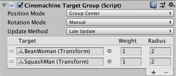

# Cinemachine Target Group

Use Cinemachine Target Group to treat multiple GameObjects as a single Look At target. Use a Target Group with the [Group Composer](CinemachineAimGroupComposer) algorithm.

To create a Virtual Camera with a Target Group:

1. In the Unity menu, choose __Cinemachine > Create Target Group Camera__.  Unity adds a new Virtual Camera and Target Group to the Scene. The __Follow__ and __Look At__ targets in the Virtual Camera refer to the new Target Group.

2. In the [Hierarchy](https://docs.unity3d.com/Manual/Hierarchy.html), select the new Target Group object.

3. In the [Inspector](https://docs.unity3d.com/Manual/UsingTheInspector.html), click the + sign to add a new item to the group.

4. In the new item, assign a GameObject, and edit the __Weight__ and __Radius__ properties.

5. To add more GameObjects to the Target Group, repeat steps 3-4.

## Properties:

| **Property:** || **Function:** |
|:---|:---|:---|
| __Position Mode__ || How to calculate the position of the Target Group. |
| | _Group Center_ | Use the center of the axis-aligned bounding box that contains all items of the Target Group. |
| | _Group Average_ | Use the weighted average of the positions of the items in the Target Group. |
| __Rotation Mode__ || How to calculate the rotation of the Target Group.  |
| | _Manual_ | Use the values specified in the Rotation properties of the Target Group’s transform.  This is the recommended setting. |
| | _Group Average_ | Weighted average of the orientation of the items in the Target Group. |
| __Update Method__ || When to update the transform of the Target Group. |
| | _Update_ | Update in the normal MonoBehaviour Update() method. |
| | _Fixed Update_ | Updated in sync with the Physics module, in FixedUpdate(). |
| | _Late Update_ | Updated in MonoBehaviour `LateUpdate()`. |
| __Targets__ || The list of target GameObjects. |
| | _Weight_ | How much weight to give the item when averaging. Cannot be negative. |
| | _Radius_ | The radius of the item, used for calculating the bounding box. Cannot be negative. |
