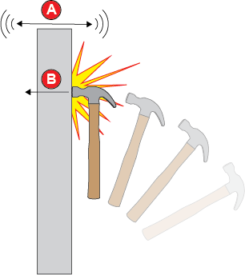

# Orientation and Direction

To create realistic vibrations, an impulse signal should be strongest along the axis of impact, and its amplitude (or strength) should be proportional to the force of the impact. For example, if you strike a wall with a hammer, the wall vibrates primarily along the axis of the hammer’s path. For the hammer’s impulse signal to be realistic, it should have the most vibration along that axis.

Rather than requiring separate signal definitions for every possible impact direction and strength, Impulse uses the concept of a “local space” for defining the raw signal. You can rotate and scale the raw signal in its local space to produce a “final” signal that matches the actual impact.

Impulse assumes that the main direction for an impact is “down,” so as a general rule, your signals should put more vibration along the Y axis (the 6D shake preset does this). You can then rely on local-space rotation and scaling to produce the correct vibrations for each impact occurrence.

## Controlling orientation and direction

The **Cinemachine Impulse Source** and **Cinemachine Collision Impulse Source** components have properties that control the orientation of the raw signal. Use these properties to mimic real-world vibration.

- For the **Cinemachine Impulse Source** component, the GenerateImpulse() method takes a velocity vector as a parameter.  This vector defines the direction and strength of the impact.  The Impulse system uses this to calculate the final signal based on the Raw signal definition, rotating and scaling it appropriately.

- For the **Cinemachine Collision Impulse Source** component, the velocity vector is generated automatically based on the directions and masses of the GameObjects involved.

  To control how this is done, use the properties in the **How to Generate the Impulse** section of the Inspector window. The **Use Impact Direction** property controls whether the signal is rotated to correspond to the impact direction.

### Direction mode

The **Spatial Range >  Direction Mode** property allows you to add a subtle tweak to the signal orientation. When you set it to **Rotate Towards Source**, the impulse signal is further rotated so that vibrations point a little more prominently in the direction of the Impulse Source.

The effect isn’t noticeable for radially symmetric vibrations, but for signals that emphasize a direction, like 6D shake, it gives a subconscious indication of where the vibration is coming from. This can be quite effective when you generate impacts in multiple locations and you don't want them to all feel the same.

The default **Direction Mode** setting of **Fixed** turns the effect off.