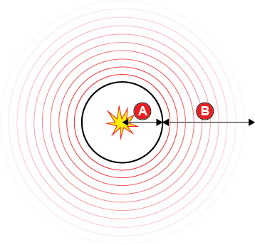

# Spatial Range

An Impulse Source’s Spatial Range properties define the zone in the Scene that the Impulse Source affects. Impulse Listeners in this zone react to the Impulse source (unless they are [filtered out](CinemachineImpulseFiltering.md)), while Listeners outside of it do not.

The zone consists of two parts: the **Impact Radius** and the **Dissipation Distance**. When the Impulse Source generates an impulse, the vibration signal stays at full strength until it reaches the end of the **Impact Radius**. Its strength then fades to zero over the **Dissipation Distance**. Together, these two properties define the signal’s total range.

The **Dissipation Mode**  property controls how the signal fades out over the **Dissipation Distance**. 

* **Exponential Decay** creates a fade-out that starts fast and slows down as it nears the end of the dissipation distance.

* **Soft Decay** creates a fade-out that starts slow, speeds up, and slows down again as it nears the end of the dissipation distance.

* **Linear Decay** creates an even fade-out over the dissipation distance.